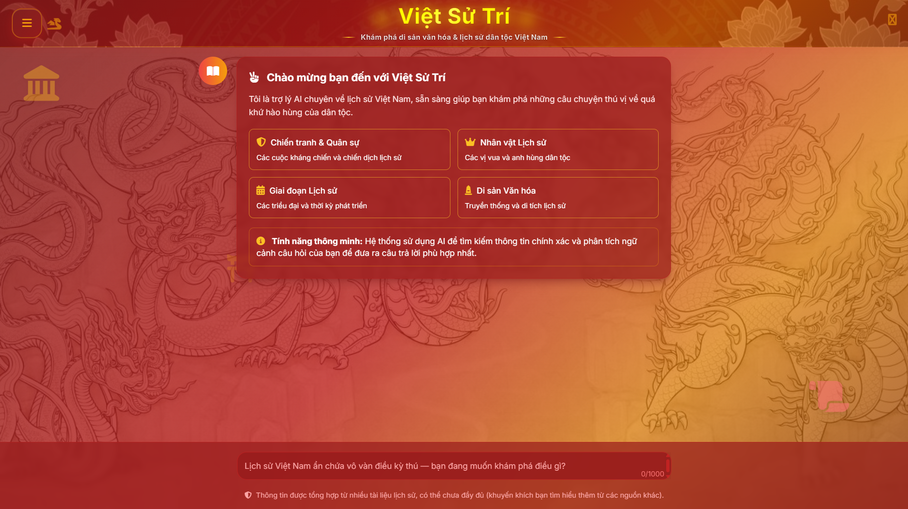
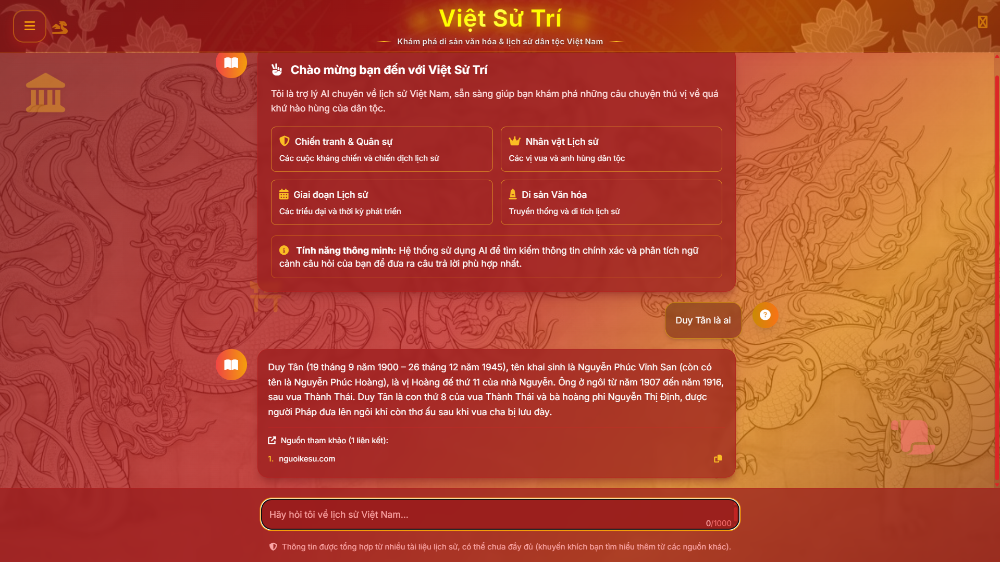
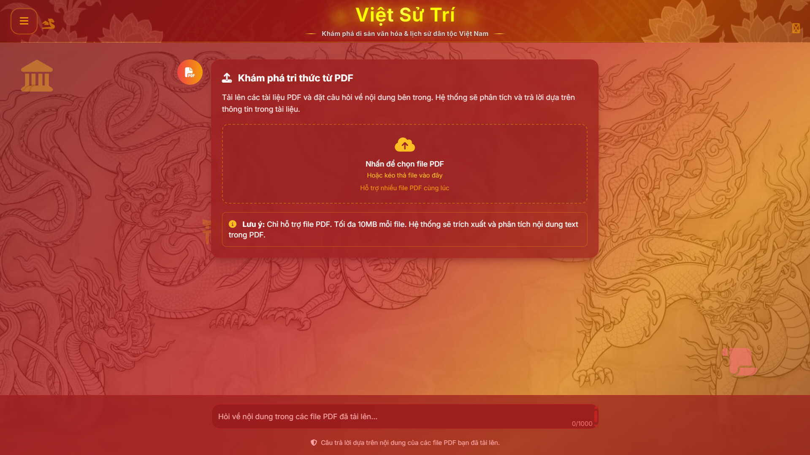

# Việt Sử Trí - Vietnamese History RAG System

<div align="center">
  
  
  
  
  
</div>

<div align="center">
  <h3>🏛️ Explore Vietnamese Cultural Heritage & National History with AI 🇻🇳</h3>
  <p><em>An intelligent RAG-powered system for Vietnamese historical knowledge discovery</em></p>
</div>

---

## 📖 Introduction

**Việt Sử Trí** (Vietnamese History Intelligence) is a sophisticated AI-powered system specialized in Vietnamese history, utilizing advanced RAG (Retrieval-Augmented Generation) technology to provide accurate and comprehensive information about Vietnamese cultural heritage, historical events, and national history.

The system combines modern AI technologies with a rich database of Vietnamese historical content, offering users an interactive and intelligent way to explore the fascinating history of Vietnam.

### ✨ Key Features

- 🏛️ **History Chat**: Interactive Q&A about Vietnamese history with a comprehensive database
- 📄 **PDF Chat**: Upload and analyze PDF documents with conversational AI
- 🔍 **Smart Search**: Hybrid search combining keyword (BM25) and semantic search
- 🎯 **Query Classification**: Automatic categorization by topic (military, figures, heritage, periods)
- 📚 **Document Reranking**: Advanced relevance scoring for optimal results
- 💬 **Conversation Memory**: Maintains context across conversation turns
- 🌐 **Responsive UI**: Beautiful Vietnamese-themed interface with smooth animations
- 🔗 **Source Attribution**: Provides source URLs for fact verification

---

## 🖼️ Demo Screenshots

### History Chat Interface
<div align="center">
  
  <p><em>Main interface for Vietnamese history conversations</em></p>
</div>

### History Chat Demo
<div align="center">
  
  <p><em>Example conversation about Vietnamese historical events</em></p>
</div>

### PDF Chat Interface
<div align="center">
  
  <p><em>PDF upload and analysis interface</em></p>
</div>

### PDF Chat Demo
<div align="center">
  
  <p><em>Interactive PDF document analysis and Q&A</em></p>
</div>

---

## 🏗️ System Architecture

### 🔄 RAG Pipeline Architecture

Our system employs a sophisticated dual-pipeline approach to handle both historical queries and PDF document analysis with maximum efficiency and accuracy.

---

#### 🏛️ **Vietnamese History Chat Pipeline**

<div align="center">

```
┌─────────────────────────────────────────────────────────────────────────────────┐
│                           🇻🇳 VIETNAMESE HISTORY RAG PIPELINE                    │
└─────────────────────────────────────────────────────────────────────────────────┘

    👤 USER INPUT                🔍 ANALYSIS STAGE              📊 RETRIEVAL STAGE
┌─────────────────┐         ┌─────────────────────┐         ┌─────────────────────┐
│                 │         │                     │         │                     │
│  "Cuộc khởi     │   ──►   │   🧠 Query Transform │   ──►   │  🔎 Keyword Search  │
│   nghĩa Hai     │         │   & Classification   │         │   (ElasticSearch)   │
│   Bà Trưng?"    │         │                     │         │                     │
│                 │         │   📝 Enhanced Query  │         │  📄 120 Candidates  │
└─────────────────┘         └─────────────────────┘         └─────────────────────┘
                                       │                               │
                                       ▼                               ▼
    🎯 RANKING STAGE               🧠 SEMANTIC STAGE              🤖 GENERATION STAGE
┌─────────────────────┐         ┌─────────────────────┐         ┌─────────────────────┐
│                     │         │                     │         │                     │
│  ⭐ Document        │   ◄──   │  🔍 Vector Search   │   ◄──   │  📊 70 Similar Docs │
│     Reranking       │         │   (Qdrant DB)       │         │                     │
│   (Cohere API)      │         │                     │         │  🎯 Top 13 Results  │
│                     │         │  📈 Similarity      │         │                     │
│  🏆 Final 13 Docs   │         │     Scoring         │         │                     │
└─────────────────────┘         └─────────────────────┘         └─────────────────────┘
           │
           ▼
┌─────────────────────────────────────────────────────────────────────────────────┐
│                        ✅ FINAL RESPONSE GENERATION                              │
│                                                                                 │
│  🤖 Gemini LLM Processing:                                                      │
│  ├── 📚 Historical Context Analysis                                            │
│  ├── 🔗 Source URL Attribution                                                 │
│  ├── 📝 Comprehensive Answer Creation                                          │
│  └── ✨ Natural Language Response                                              │
│                                                                                 │
│  📤 OUTPUT: "Cuộc khởi nghĩa Hai Bà Trưng diễn ra từ năm 40-43..."            │
└─────────────────────────────────────────────────────────────────────────────────┘
```

</div>

---

#### 📄 **PDF Document Analysis Pipeline**

<div align="center">

```
┌─────────────────────────────────────────────────────────────────────────────────┐
│                              📄 PDF CHAT PIPELINE                               │
└─────────────────────────────────────────────────────────────────────────────────┘

    📁 UPLOAD STAGE              📖 PROCESSING STAGE            💾 STORAGE STAGE
┌─────────────────┐         ┌─────────────────────┐         ┌─────────────────────┐
│                 │         │                     │         │                     │
│  📄 PDF Files   │   ──►   │  📖 Text Extraction │   ──►   │  🔢 Vector         │
│  (Max 50MB)     │         │   (PyPDF Library)   │         │     Embedding       │
│                 │         │                     │         │                     │
│  📋 Multi-file  │         │  ✂️ Smart Chunking  │         │  💾 Temporary       │
│     Support     │         │   (Overlap Strategy) │         │     Vector Store    │
└─────────────────┘         └─────────────────────┘         └─────────────────────┘
                                       │                               │
                                       ▼                               ▼
    👤 QUERY STAGE                 🔍 SEARCH STAGE               🤖 RESPONSE STAGE
┌─────────────────────┐         ┌─────────────────────┐         ┌─────────────────────┐
│                     │         │                     │         │                     │
│  "Summarize the     │   ──►   │  🎯 Similarity      │   ──►   │  📊 Relevant Chunks │
│   main events in    │         │     Search          │         │                     │
│   this document"    │         │                     │         │  🧠 Context         │
│                     │         │  📈 Relevance       │         │     Assembly        │
│  ⏱️ Real-time       │         │     Scoring         │         │                     │
│     Processing      │         │                     │         │  ✨ Answer Synthesis│
└─────────────────────┘         └─────────────────────┘         └─────────────────────┘
                                                                           │
                                                                           ▼
┌─────────────────────────────────────────────────────────────────────────────────┐
│                           📤 CONTEXTUAL RESPONSE                                │
│                                                                                 │
│  🎯 Features:                                                                   │
│  ├── 📚 Document-specific answers                                              │
│  ├── 🔍 Citation of relevant sections                                          │
│  ├── 📊 Multi-document synthesis                                               │
│  └── 🚫 No external source URLs (PDF-only)                                     │
└─────────────────────────────────────────────────────────────────────────────────┘
```

</div>

---

#### 🔧 **Technical Implementation Details**

<details>
<summary><strong>🏗️ Click to expand technical architecture</strong></summary>

```python
# Simplified Pipeline Flow
class RAGPipeline:
    def process_history_query(self, query: str) -> dict:
        """
        🏛️ Vietnamese History Pipeline
        """
        # Step 1: Query Analysis & Enhancement
        enhanced_query = self.gemini_service.transform_query(query)
        
        # Step 2: Hybrid Retrieval
        candidates = self.elasticsearch.bm25_search(enhanced_query, limit=120)
        similar_docs = self.qdrant.vector_search(enhanced_query, candidates, limit=70)
        
        # Step 3: Intelligent Reranking
        top_docs = self.cohere.rerank(enhanced_query, similar_docs, limit=13)
        
        # Step 4: Answer Generation
        response = self.gemini_service.generate_answer(query, top_docs)
        
        return {
            "answer": response.text,
            "sources": response.source_urls,
            "confidence": response.confidence_score
        }
    
    def process_pdf_query(self, query: str, pdf_files: list) -> dict:
        """
        📄 PDF Analysis Pipeline
        """
        # Step 1: Document Processing
        chunks = self.pdf_service.extract_and_chunk(pdf_files)
        
        # Step 2: Temporary Vector Storage
        vector_store = self.create_temp_vectorstore(chunks)
        
        # Step 3: Similarity Search
        relevant_chunks = vector_store.similarity_search(query, k=10)
        
        # Step 4: Contextual Response
        response = self.gemini_service.generate_pdf_answer(query, relevant_chunks)
        
        return {
            "answer": response.text,
            "sources": [],  # No external sources for PDF
            "document_refs": response.chunk_references
        }
```

</details>

---

### Core Components

| Component                | Technology        | Purpose                                |
|--------------------------|-------------------|----------------------------------------|
| **RAGService**           | Python/LangChain  | Orchestrates the entire RAG pipeline   |
| **GeminiService**        | Google Gemini API | Query processing and answer generation |
| **QdrantService**        | Qdrant Vector DB  | Vector similarity search               |
| **ElasticSearchService** | ElasticSearch     | BM25 keyword search                    |
| **RerankService**        | Cohere API        | Document relevance reranking           |
| **PDFRAGService**        | PyPDF/LangChain   | PDF processing and analysis            |
| **Flask App**            | Flask/HTML/CSS/JS | Web interface and API endpoints        |

---

## 🚀 Installation & Setup

### Prerequisites

- **Python 3.8+**
- **8GB RAM** (recommended)
- **CUDA GPU** (optional, for PyTorch acceleration)
- **API Keys** for Gemini, OpenAI, Cohere
- **Vector Database** (Qdrant)
- **Search Engine** (ElasticSearch)

### 1. Clone Repository

```bash
git clone https://github.com/hoangphihung2004/HistoryVietNam.git
cd HistoryVietNam
```

### 2. Environment Setup

```bash
# Create virtual environment
python -m venv venv

# Activate virtual environment
source venv/bin/activate  # Linux/Mac
# or
venv\Scripts\activate     # Windows

# Install dependencies
pip install -r requirements.txt
```

### 3. Configuration

Create a `.env` file in the root directory:

```env
# AI Service API Keys
GOOGLE_API_KEY=your_gemini_api_key
OPENAI_API_KEY=your_openai_api_key
COHERE_API_KEY=your_cohere_api_key

# Vector Database Configuration
QDRANT_URL=your_qdrant_url
QDRANT_API_KEY=your_qdrant_api_key
QDRANT_COLLECTION_NAME=vietnamese_history

# Search Engine Configuration
ELASTICSEARCH_URL=your_elasticsearch_url
ELASTICSEARCH_INDEX=history_documents

# Database Configuration (Optional)
MYSQL_HOST=localhost
MYSQL_USER=your_username
MYSQL_PASSWORD=your_password
MYSQL_DATABASE=vietnamese_history

# Application Settings
FLASK_ENV=production
MAX_FILE_SIZE=50MB
UPLOAD_FOLDER=temp_uploads
```

### 4. Run Application

```bash
python app.py
```

🌐 **Access the application at:** `http://localhost:5000`

---

## 📊 Data Collection & Sources

### 🌐 **Primary Data Sources**

Our comprehensive Vietnamese history database is built from carefully curated sources to ensure accuracy and reliability:

| Source | Type | Content Coverage | Data Volume |
|--------|------|------------------|-------------|
| **📖 [Wikipedia Vietnam](https://vi.wikipedia.org)** | Encyclopedia | Historical events, figures, periods, cultural heritage | ~800 articles |
| **👥 [Nguoi Ke Su](https://nguoikesu.com)** | Cultural Platform | Historical narratives, folk stories, cultural traditions | ~600 articles |
| **🏛️ [DSVH Vietnam](https://dsvh.gov.vn)** | Government Portal | Official cultural heritage, monuments, historical sites | ~400 documents |

### 🔧 **Data Collection Process**

<div align="center">

```
┌─────────────────────────────────────────────────────────────────────────────────┐
│                           📊 DATA COLLECTION PIPELINE                           │
└─────────────────────────────────────────────────────────────────────────────────┘

    🌐 WEB SCRAPING              📝 DATA PROCESSING             💾 STORAGE & INDEXING
┌─────────────────┐         ┌─────────────────────┐         ┌─────────────────────┐
│                 │         │                     │         │                     │
│  🕷️ Web Crawler │   ──►   │  🧹 Data Cleaning   │   ──►   │  📚 ElasticSearch   │
│   (Selenium)    │         │   & Validation      │         │     Indexing        │
│                 │         │                     │         │                     │
│  📄 HTML Parser │         │  📊 Content         │         │  🔢 Vector          │
│  (BeautifulSoup)│         │     Structuring     │         │     Embeddings      │
└─────────────────┘         └─────────────────────┘         └─────────────────────┘
           │                           │                               │
           ▼                           ▼                               ▼
┌─────────────────────────────────────────────────────────────────────────────────┐
│                            ✅ QUALITY ASSURANCE                                 │
│                                                                                 │
│  🔍 Data Validation:                                                            │
│  ├── 📝 Content deduplication                                                  │
│  ├── 🏷️ Metadata extraction (dates, categories, sources)                       │
│  ├── 🔗 URL preservation for source attribution                                │
│  └── 📊 Content categorization (MILITARY, FIGURE, PERIOD, HERITAGE, STAGE)     │
└─────────────────────────────────────────────────────────────────────────────────┘
```

</div>

### 📈 **Data Statistics**

| Metric | Value | Description |
|--------|-------|-------------|
| **📚 Total Documents** | 2,000+ | Processed historical articles and documents |
| **🏷️ Categories** | 5 main types | MILITARY, FIGURE, PERIOD, HERITAGE, STAGE |
| **🔗 Source URLs** | 1,800+ | Preserved for fact verification |
| **📊 Vector Embeddings** | 50,000+ | Semantic search vectors |
| **🕐 Time Coverage** | 4,000+ years | From ancient times to modern Vietnam |
| **🌐 Languages** | Vietnamese | Primary language with some English references |

### 🛡️ **Data Quality & Ethics**

- **✅ Compliance**: All data collection follows robots.txt and website terms of service
- **🔍 Verification**: Cross-referencing multiple sources for accuracy
- **📝 Attribution**: Proper source citation and URL preservation
- **🔄 Updates**: Regular data refresh to maintain currency
- **🛡️ Privacy**: No personal data collection, only public historical information

---

## 📁 Project Structure

```
HistoryVietNam/
├── 📄 app.py                      # Main Flask application
├── 📄 requirements.txt            # Python dependencies
├── 📄 .env                       # Environment variables
├── 📄 .gitignore                 # Git ignore rules
├── 📁 services/                  # Core AI services
│   ├── 🐍 rag_service.py         # Main RAG pipeline
│   ├── 🐍 gemini_service.py      # Gemini LLM integration
│   ├── 🐍 qdrant_service.py      # Vector database service
│   ├── 🐍 elastic_search_service.py # Keyword search
│   └── 🐍 conversation_history.py # Chat memory management
├── 📁 pdf_services/              # PDF processing
│   ├── 🐍 pdf_rag_service.py     # PDF RAG pipeline
│   └── 🐍 load_pdf.py           # PDF text extraction
├── 📁 re_ranking/                # Document reranking
│   └── 🐍 re_ranking.py         # Cohere reranking service
├── 📁 templates/                 # HTML templates
│   └── 🌐 index.html            # Main web interface
├── 📁 static/                    # Frontend assets
│   ├── 🎨 app.js                # JavaScript functionality
│   ├── 🎨 menu-enhanced.css     # UI styling
│   └── 📁 images/               # UI images and icons
├── 📁 images/                    # Demo screenshots
│   ├── 🖼️ interface_chat_history.png
│   ├── 🖼️ demo_chat_history.png
│   ├── 🖼️ interface_chat_pdf.png
│   └── 🖼️ demo_chat_pdf.png
├── 📁 embedding_data/            # Vector embeddings storage
├── 📁 raw_data/                  # Scraped historical data
│   ├── 📂 wikipedia/             # Wikipedia articles
│   ├── 📂 nguoikesu/             # Cultural narratives
│   └── 📂 dsvh/                  # Government heritage docs
├── 📁 temp_uploads/              # Temporary file uploads
└── 📁 system_evaluation/         # Performance evaluation
```

---

## 🔧 API Documentation

### 1. History Chat Endpoint

**Query Vietnamese historical database**

```http
POST /api/rag-chat
Content-Type: application/json

{
  "message": "Cuộc khởi nghĩa của Hai Bà Trưng diễn ra như thế nào",
  "timestamp": "2024-01-01T00:00:00Z"
}
```

**Response:**
```json
{
  "success": true,
  "answer": "Cuộc khởi nghĩa Hai Bà Trưng diễn ra từ năm 40 đến năm 43 sau Công nguyên. Hai chị em Trưng Trắc và Trưng Nhị đã lãnh đạo cuộc nổi dậy này chống lại ách đô hộ của nhà Hán (Trung Quốc), lập nên một vương quốc độc lập tồn tại trong ba năm trước khi bị đánh bại bởi tướng Mã Viện của nhà Hán.",
  "source_urls": [
    "https://example.com/trung-sisters-history",
    "https://example.com/vietnamese-rebellions"
  ]
}
```

### 2. PDF Chat Endpoint

**Upload and analyze PDF documents**

```http
POST /api/pdf-rag-chat
Content-Type: multipart/form-data

message: "Summarize the main historical events mentioned in this document"
timestamp: "2024-01-01T00:00:00Z"
pdf_0: [file.pdf]
pdf_1: [file2.pdf] (optional, multiple files supported)
```

**Response:**
```json
{
  "success": true,
  "answer": "Dựa trên tài liệu đã tải lên, các sự kiện lịch sử chính bao gồm: 1) Việc thành lập triều Nguyễn vào năm 1802, 2) Giai đoạn Pháp đô hộ từ năm 1858 đến 1954, 3) Cách mạng Tháng Tám năm 1945, và 4) Sự thống nhất đất nước Việt Nam vào năm 1976.",
  "source_urls": []
}
```

### 3. Health Check Endpoint

**Monitor system status**

```http
GET /api/health
```

**Response:**
```json
{
  "status": "healthy",
  "services": {
    "rag_service": true,
    "pdf_rag_service": true,
    "gemini_service": true,
    "qdrant_service": true,
    "elasticsearch_service": true
  },
  "timestamp": "2024-01-01T12:00:00Z"
}
```

---

## 🎨 User Interface Features

### Design Highlights
- **🎨 Vietnamese Cultural Theme**: Traditional red and gold color scheme with cultural symbols
- **📱 Responsive Design**: Optimized for desktop, tablet, and mobile devices
- **✨ Smooth Animations**: Elegant transitions and loading indicators
- **🌙 Dark Theme**: Eye-friendly interface with Vietnamese aesthetic
- **🔄 Real-time Updates**: Live typing indicators and instant responses

### Interactive Elements
- **📁 Drag & Drop**: Easy PDF file uploads with visual feedback
- **🗂️ Menu System**: Organized navigation with chat mode switching
- **🧹 Chat Management**: Clear conversation history with confirmation dialogs
- **📊 Character Counter**: Real-time input validation and limits
- **🔗 Source Links**: Clickable references for fact verification

---

## 🔍 Supported Historical Topics

| Category | Description | Examples |
|----------|-------------|----------|
| **🛡️ MILITARY** | Wars, battles, military campaigns | Vietnam War, French Indochina War, Mongol invasions |
| **👑 FIGURE** | Historical personalities | Hồ Chí Minh, Trưng Sisters, Lê Lợi, Nguyễn Huệ |
| **⏰ PERIOD** | Historical eras and dynasties | Lý Dynasty, Trần Dynasty, French Colonial Period |
| **🏛️ HERITAGE** | Cultural sites and traditions | Hạ Long Bay, Hội An, Traditional festivals |
| **📈 STAGE** | Development phases | Economic reforms, Đổi Mới policy, Modernization |

---

## 📊 Performance Metrics

| Metric                  | Value         | Description                              |
|-------------------------|---------------|------------------------------------------|
| **⚡ Response Time**     | < 9.5 seconds | Average query processing time            |
| **🎯 Precision**        | 100%          | Accuracy of relevant results returned    |
| **🔍 Recall**           | 100%          | Coverage of relevant documents retrieved |
| **📄 PDF Size Limit**   | 10MB          | Maximum file upload size                 |
| **💾 Database Size**    | 2,000+ docs   | Historical document collection           |

---

## 🙏 Acknowledgments

We extend our gratitude to the following technologies and communities:

### AI & ML Technologies
- **🤖 LangChain**: Comprehensive framework for LLM applications
- **🧠 Google Gemini**: Advanced language model for answer generation
- **🔍 Qdrant**: High-performance vector similarity search
- **📊 ElasticSearch**: Powerful full-text search and analytics
- **🎯 Cohere**: State-of-the-art reranking capabilities

### Development Tools
- **🐍 Python**: Core programming language
- **🌐 Flask**: Lightweight and flexible web framework
- **⚡ PyTorch**: Deep learning framework for embeddings
- **📄 BeautifulSoup**: HTML/XML parsing for data extraction

### Vietnamese History Resources
- **📚 National Archives**: Historical document sources
- **🏛️ Museums**: Cultural heritage information
- **📖 Academic Research**: Scholarly historical works
- **🌐 Digital Libraries**: Online historical collections

### Data Sources
- **📖 Wikipedia Vietnam**: [vi.wikipedia.org](https://vi.wikipedia.org) - Comprehensive Vietnamese historical articles
- **👥 Nguoi Ke Su**: [nguoikesu.com](https://nguoikesu.com) - Historical storytelling and cultural narratives
- **🏛️ DSVH Vietnam**: [dsvh.gov.vn](https://dsvh.gov.vn) - Official cultural heritage documentation

---

## 📞 Contact & Support

- **📧 Email**: [hoangphihung0404@gmail.com](mailto:hoangphihung0404@gmail.com)
- **🐙 GitHub**: [https://github.com/hoangphihung2004](https://github.com/hoangphihung2004)

<div align="center">
  <h2>🇻🇳 Việt Sử Trí 🇻🇳</h2>
  <p><strong>Preserving and Sharing Vietnamese Heritage</strong></p>
  <p><em>Made with ❤️ for Vietnamese History and Culture</em></p>
</div>

---